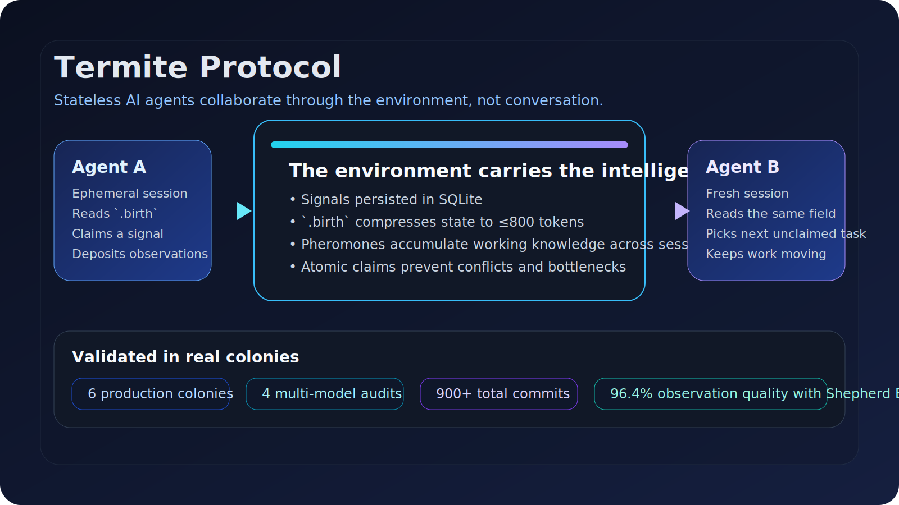

[English](README.md)

# 白蚁协议 Termite Protocol

[](https://github.com/billbai-longarena/Termite-Protocol/releases)
[](LICENSE)
[](https://github.com/billbai-longarena/Termite-Protocol/discussions)

**让无状态的 AI Agent 像白蚁一样协作：无需对话，无需记忆，通过环境自发涌现秩序。**

[官网](https://billbai-longarena.github.io/Termite-Protocol/) · [快速上手](QUICKSTART.md) · [最新 Release](https://github.com/billbai-longarena/Termite-Protocol/releases/tag/v1.1.1)



## 30 秒看懂

**白蚁协议** 是一套面向 AI 编码 Agent 的跨会话协作框架。

它解决的是当前工具链里的一个结构性矛盾：

- AI Agent 的会话天然是无状态、一次性的。
- 软件项目却需要持续上下文、协作和记忆。
- 很多多 Agent 框架依赖对话协调，这既昂贵也脆弱。

白蚁协议把协调能力放进环境里，而不是放进 Agent 的对话里：

- 信号持久化在 SQLite
- 任务通过原子 claim 认领
- 观察像信息素一样跨会话沉积
- 新 Agent 到达时读取 `.birth` 快照，而不是重读一整份长协议

### 它和其他方案最不一样的地方

- **环境优先**：Agent 不需要彼此对话，只需要感知同一个场。
- **上下文开销低**：`.birth` 将运行上下文压缩到 ≤800 tokens。
- **适合强弱模型混编**：强模型先做示范，弱模型跟随结构模板执行。
- **适合长期项目**：知识不会随着单次会话结束而消失。
- **有实证数据**：已在 6 个生产蚁丘、4 次多模型审计实验、900+ commits 中验证。

## 不是口号，是实证

### Shepherd Effect（牧羊效应）

在 touchcli A-005 实验中，**1 个 Codex 牧羊人 + 2 个 Haiku 工人实现了 96.4% 的观察质量**。

它的机制非常直接：

1. 强模型先在环境里留下高质量范式
2. 后续工人从 `.birth` 读到这个模板
3. 弱模型通过上下文学习模仿结构

所以白蚁协议不是“又一个 agent orchestration”。它更像是一套让**无状态、强弱混编 Agent 能长期稳定协作**的环境协议。

### 关键实验对比

| 配置 | 观察质量 | 交接质量 | 结论 |
| --- | --- | --- | --- |
| 2 个 Haiku 独立工作 | **35.7%** | 0% | 纯弱模型质量快速退化 |
| 1 个 Codex + 2 个 Haiku | **96.4%** | 99% | 牧羊效应成立 |
| 5 模型混合群 | **57%** | 100% | 吞吐提高，但质量需要控制 |

### 真实蚁丘数据

| 蚁丘 | 模型组合 | Commits | Signals | 关键发现 |
| --- | --- | --- | --- | --- |
| `0227` SalesTouch | 生产环境 | — | — | 稳定生产参考蚁丘 |
| `A-001` OpenAgentEngine | 2 Codex | 54 | — | 首个审计闭环完成 |
| `A-003` ReactiveArmor | Codex + 2 Haiku | 121 | 24 | 弱模型能循环，但判断差 |
| `A-005` touchcli | Codex + 2 Haiku | 130 | 6 | 牧羊效应验证 |
| `A-006` touchcli | 5 模型 | 562 | 113 | 吞吐最高，也暴露饥饿和稀释问题 |

## 什么时候适合用

### 适合

| 场景 | 原因 |
| --- | --- |
| 多 Agent 并行开发 | 原子认领避免双重分配 |
| 强弱模型混编 | 强模型可以给弱模型留下可模仿的模式 |
| 长周期项目 | 跨会话记忆会持续积累 |
| 大规模重构 | 文件级任务适合高并行 |
| 需要审计痕迹 | 信号、观察、规则都可追溯 |

### 不适合

| 场景 | 为什么不适合 | 更好的选择 |
| --- | --- | --- |
| 很小的一次性任务 | 协议开销大于收益 | 直接用单个编码 Agent |
| 开放式探索研究 | 更依赖整体判断而不是结构化执行 | 直接用强模型交互 |
| 很短的小脚本 | 不需要场记忆和任务认领 | 保持简单 |

## 60 秒冒烟测试

在一个全新目录里运行：

```bash
mkdir termite-demo && cd termite-demo
curl -fsSL https://raw.githubusercontent.com/billbai-longarena/Termite-Protocol/main/install.sh | bash
./scripts/field-arrive.sh
ls -la
./scripts/field-pulse.sh
sqlite3 .termite.db "select id,status,title from signals;"
```

如果首轮成功，你会看到：

- `BLACKBOARD.md`
- `CLAUDE.md` 和 `AGENTS.md`
- `.termite.db` 中的一条初始信号，例如 `S-001 | open | ...`
- 首次到达后 `field-pulse.sh` 输出里的 `signals=1`
- 自动计算出的 `.birth` 快照

完整上手请看 `QUICKSTART.md:1`。

## 它是怎么工作的

### Agent 生命周期

```text
Agent 到达
  → field-arrive.sh 计算 .birth
  → Agent 读取当前蚁丘快照
  → field-claim.sh 原子认领未分配任务
  → Agent 执行工作
  → field-deposit.sh 沉积观察 / 决策 / 状态
  → 下一个 Agent 继续从环境接力
```

### 核心机制

#### 1. 智能在环境里，不在对话里

对话式框架假设 Agent 本身必须持续携带大量上下文；白蚁协议把协调能力搬到环境中：

- 信号在 SQLite 中
- 信息素历史在仓库状态中
- 模板在 `.birth` 中
- 安全规则和恢复提示在到达时动态计算

#### 2. `.birth` 替代“重读整份协议”

新会话不需要重新阅读 28K token 的协议文档。

| 方案 | 上下文成本 | Agent 需要读什么 |
| --- | --- | --- |
| 直接读完整协议 | ~40% 上下文窗口 | `TERMITE_PROTOCOL.md` |
| **白蚁 `.birth`** | **~2%** | 动态计算的运行快照 |
| 重对话协调方案 | ~5–15%+ | 角色 prompt + 不断增长的聊天记录 |

#### 3. 原子信号认领

认领通过 SQLite 事务完成：

- 无调度器瓶颈
- 无双重分配
- 无对话开销
- 心跳超时后可回收停滞 claim

#### 4. 规则从重复证据中涌现

当同类观察持续出现并累积到足够证据时，系统可以把它晋升为规则。

这样环境会越来越“聪明”，而不是让每个新 Agent 重复踩坑。

## 仓库结构

```text
your-project/
  TERMITE_PROTOCOL.md   ← 人类参考文档 + 脚本配置源
  CLAUDE.md / AGENTS.md ← Agent 入口文件
  BLACKBOARD.md         ← 动态状态快照
  WIP.md                ← 跨会话交接
  .birth                ← 计算得到的初始化快照（≤800 tokens）
  .pheromone            ← 最新信息素链
  scripts/
    field-arrive.sh     ← 计算 .birth
    field-claim.sh      ← 原子任务认领
    field-cycle.sh      ← sense → act → notice → deposit
    field-deposit.sh    ← 写入观察与状态
    field-pulse.sh      ← 项目健康快照
    termite-db.sh       ← SQLite WAL 模式数据库
  signals/              ← active / archived / claims / observations / rules
```

## 从这里开始

- `QUICKSTART.md:1` — 首次安装、首次到达、首次信号
- `docs/releases/v1.1.1.md:1` — 当前仓库打包发布说明
- `docs/knowledge-base/README.md:1` — 概念卡片与协议洞察
- `docs/marketing/README.md:1` — 发布文案、长文草稿与首页文案
- `CONTRIBUTING.md:1` — 如何安全、高效地贡献
- `SUPPORT.md:1` — 提问和报 bug 的分流方式
- `SECURITY.md:1` — 漏洞上报方式
- `CHANGELOG.md:1` — 仓库版本变更记录

## 研究与审计材料

这个仓库内已经包含支撑协议论点的材料：

- `audit-packages/` — 真实实验的审计包
- `audit-analysis/` — 分析材料和防退化工具包
- `docs/plans/` — 设计文档、实验计划、协议演进记录
- `docs/knowledge-base/` — 从实战中抽取出的高复用结论

## 可选配套项目

Termite Commander 是一个可选的自动化配套项目，用于脚本化调度和监督蚁群；**使用白蚁协议本身并不依赖它**。

## 参与贡献

问题讨论请优先放到 Discussions；可复现 bug 和明确需求请放到 Issues。

比较适合的贡献起点：

- onboarding 和文档清晰度
- 可复现的冒烟测试
- 实验与审计材料整理
- shell 脚本鲁棒性和安装流程

详细流程见 `CONTRIBUTING.md:1`。

## 许可证

MIT，见 `LICENSE`。
