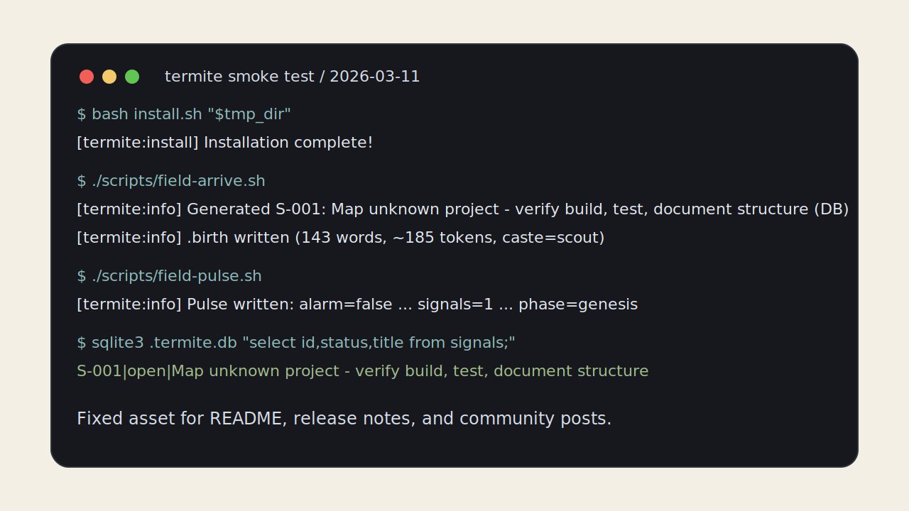

# Smoke Test Proof / 冒烟测试固定素材

This page captures a successful maintainer smoke test for the current repository state.

这页固定记录一次成功的维护者 smoke test，方便对外展示和对照排查。

## Capture metadata

- Date: March 11, 2026
- Environment: local checkout of `billbai-longarena/Termite-Protocol`
- Host shell: `zsh`
- Install mode: `bash install.sh "$tmp_dir"` into a fresh temporary directory

## Terminal snapshot



## Commands used

```bash
tmp_dir=$(mktemp -d)
bash install.sh "$tmp_dir"
cd "$tmp_dir"
./scripts/field-arrive.sh
ls -la
./scripts/field-pulse.sh
sqlite3 .termite.db "select id,status,title from signals;"
```

## Success markers

- `BLACKBOARD.md` exists
- `.birth` exists
- `field-pulse.sh` reports `signals=1`
- SQLite contains `S-001|open|...`
- the first arrival writes a computed `.birth` snapshot

## Captured output excerpt

```text
[termite:install] Installation complete!
[termite:info]  Generated S-001: Map unknown project - verify build, test, document structure (DB)
[termite:info]  === .birth written (143 words, ~185 tokens, caste=scout, strength=judgment) ===
[termite:info]  Pulse written: alarm=false wip=absent build=unknown signals=1 holes=0 parked=0 expired_claims=0 cleaned_claims=0 phase=genesis
S-001|open|Map unknown project - verify build, test, document structure
```

## Notes

- The captured run was executed in a fresh temp directory, so the installer correctly warned that Git hooks were not installed.
- The exact temporary path and agent identifier will vary across runs.
- If your result differs on the success markers above, open a Discussion before assuming protocol misuse.
